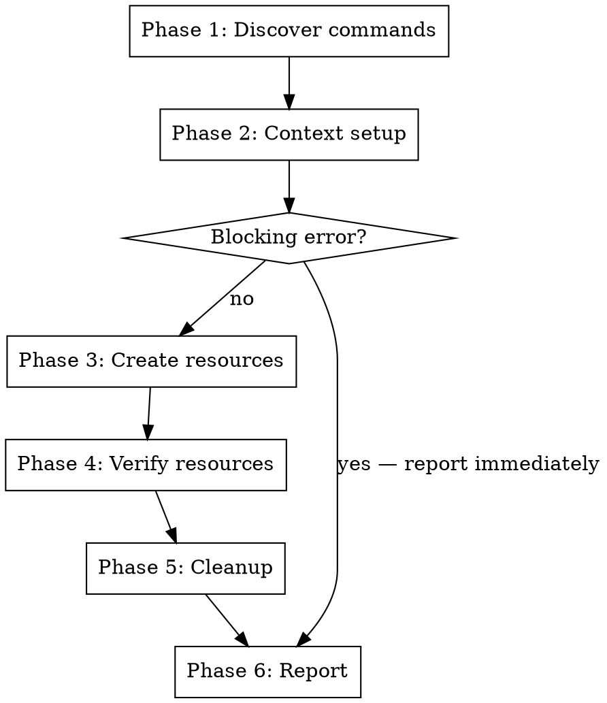

# am-dx — CLI Developer Experience Testing

Autonomous DX testing for `amctl`. Runs through the agent dev workflow as a real user would, evaluates the experience, and reports findings as a narrative with a structured findings table.

## Prerequisites

- Local agent-manager service is running
- `./amctl` binary exists in `/Users/jhivan/Developer/agent-manager/cli/`
- User is already logged in (do NOT attempt login)
- Use `./amctl` always — never the system PATH binary unless user explicitly says otherwise

## Workflow

Run from `/Users/jhivan/Developer/agent-manager/cli/`.



### Phase 1: Discovery

Scan what commands exist right now. Run `./amctl --help` and recurse into subcommands. Do NOT hardcode a command list — adapt to whatever is available at invocation time.

Record the command tree for use in the consistency evaluation.

### Phase 2: Context Setup

```bash
./amctl context show
./amctl context org list
./amctl context org use <pick-local>
./amctl context instance list
./amctl context instance use <pick-local>
./amctl context show   # verify it stuck
```

**Edge probes:**
- `./amctl context org use nonexistent-org`
- `./amctl context instance use ""`
- `./amctl context show` with no context set (if possible to clear)

### Phase 3: Create Resources

```bash
./amctl project create dx-test-<timestamp>
```

If an agent deploy/create command exists:
```bash
./amctl agent deploy <appropriate-args>
```

If deploy doesn't exist yet, note its absence in the report and skip.

Use identifiable test names prefixed with `dx-test-` so cleanup is unambiguous.

**Edge probes:**
- Create with missing required flags
- Create with duplicate name
- Create with invalid characters in name

### Phase 4: Verify

```bash
./amctl project list
./amctl project get <id-from-create>
./amctl agent list
./amctl agent get <id>   # if agent was created
```

**Edge probes:**
- `./amctl project get nonexistent-id`
- `./amctl agent get ""`
- `./amctl project list` output format vs `agent list` (consistency check)

### Phase 5: Cleanup

```bash
./amctl agent delete <id>    # if agent was created
./amctl project delete <id>
```

Verify cleanup by re-listing. Confirm resources are gone.

**Edge probes:**
- Delete already-deleted resource
- Delete with invalid ID

### Phase 6: Report

Produce two outputs:

#### Narrative (primary)

Write as a first-person walkthrough. Cover the full session chronologically:

> "I started by checking what commands were available. Running `./amctl --help` showed..."

Weave observations naturally into the story. Call out friction, confusion, delight, and suggestions as they arise. The narrative should read like a UX researcher's session notes.

#### Findings Table (supplementary)

| Category | Severity | Command | Finding | Suggested Fix |
|----------|----------|---------|---------|---------------|
| ... | ... | ... | ... | ... |

## Evaluation Dimensions

Assess every command against all five:

### 1. Output Clarity
- Are success messages informative or uselessly silent?
- Are error messages helpful? Do they suggest what to do next?
- Is important info (IDs, names, status) surfaced prominently?
- Is JSON output well-structured when `--json` is used?

### 2. Consistency
- Do similar commands use the same flag names?
- Is output format uniform across command groups (tables, columns, spacing)?
- Are exit codes consistent (0 success, non-zero failure)?
- Do CRUD commands follow the same patterns?

### 3. Flow Friction
- Are there unexpected interactive prompts?
- Are defaults sensible? Can you skip optional flags?
- Is the number of steps reasonable for common operations?
- Does the CLI guide you toward the next action?

### 4. Edge Cases
- Graceful handling of invalid input?
- Helpful errors that point toward the fix?
- No crashes, panics, or stack traces on bad input?
- Idempotent operations where expected?

### 5. Help Text Quality
- Are `--help` descriptions clear and complete?
- Do examples exist where they'd help?
- Are required vs optional flags obvious?
- Is the command hierarchy discoverable?

## Severity Levels

- **cosmetic** — nitpick, no real user confusion
- **minor** — noticeable friction, workaround obvious
- **major** — would block or seriously confuse a new user

## Behavior Rules

- **Non-destructive** — only create `dx-test-*` resources, always clean up
- **Stop on blockers** — if context setup fails, report immediately
- **Adapt** — if a command doesn't exist, skip it and note the gap
- **No login** — assume authenticated
- **Be thorough** — exercise every flag, every output mode, every edge case you can think of
- **Compare** — when evaluating consistency, compare every command group against each other
